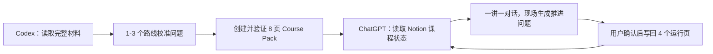

# Notion Course Pack Init

把一本书、一门课程或一组正式材料，初始化成可以在 ChatGPT 里持续学习、在 Notion 里保存真实进度的课程工作区。

它会先完整读取你指定的材料，再确认学习目标和起点，设计学习路线，创建 Notion Course Pack，并回读验证页面是否真的写对。初始化完成后，Codex 退出日常教学链路，ChatGPT 负责一讲一讲推进课程。

## 它解决什么问题

普通的“让 AI 教我一本书”很容易在几次对话后失去状态：课程路线藏在聊天记录里，AI 不知道哪些内容真正学过，笔记、进度和下次入口也彼此分离。

Notion Course Pack 把这些职责拆成 8 个页面：

| 页面 | 作用 |
|---|---|
| Course Home | 课程入口、正式范围、Runtime Index、继续上课命令 |
| Runtime Snapshot | 当前节点、下一讲入口、最近状态 |
| Course_Map | 来源能力架构与经过校准的个性化路线 |
| Course_State & Profile | 真实进度证据与稳定学习画像 |
| Sources & Coverage | 材料读取范围及双向映射 |
| Sessions | 每讲的问题、判断、讲解与推进结果 |
| Notes Inbox | 按知识对象组织的候选笔记 |
| Codex Handoff Queue | 结构、权限、材料和修复事项 |

初始化与上课分开：



## 使用前必须知道的边界

Skill 能完成工作区页面、课程结构、材料审计、Notion 写入和回读验证，但不能绕过 Notion 的 OAuth 与权限系统。

首次使用需要两条连接：

1. **Codex → Notion**：用于创建、修复和验证 Course Pack。
2. **ChatGPT → Notion**：用于日常上课时读取课程状态并写回进度。

Skill 可以检测缺失连接、准备配置并启动登录流程；OAuth 授权页仍必须由用户本人确认。这是安全边界，不应被包装成“全自动”。除此之外，用户需要做的是正常提供材料、回答一至三个路线校准问题，以及在课程结束时确认是否写回。

## 安装

### 让 Agent 安装

在支持 `SKILL.md` 的 Codex 或 Agent 中输入：

```text
帮我安装这个 skill：
https://github.com/AlphaMao1/AlphaMao_Skills/tree/main/skills/notion-course-pack-init
```

安装完成后新开一个任务，使 Skill 列表重新加载。

### 手动安装

克隆仓库：

```bash
git clone https://github.com/AlphaMao1/AlphaMao_Skills.git
```

把 `skills/notion-course-pack-init` 整个目录复制到 Codex 的 skills 目录：

- Windows：`%USERPROFILE%\.codex\skills\notion-course-pack-init`
- macOS / Linux：`~/.codex/skills/notion-course-pack-init`

不要只复制 `SKILL.md`。运行所需的 `references/`、`assets/` 和 `scripts/` 必须保留。

### 环境要求

- 支持 Skills 的 Codex 环境；
- Python 3.10 或更高版本，仅使用标准库；
- 可登录的 Notion 账号，并对目标页面拥有所需权限；
- 可连接 Notion App 的 ChatGPT。

## 首次配置

### 1. 在 Codex 中启动工作区初始化

不需要先手工创建一堆 Notion 页面。告诉 Codex 你要把哪个 Notion 页面作为课程总入口：

```text
使用 $notion-course-pack-init 初始化我的课程工作区。
目标 Notion 顶层页面是：<页面 URL>
如果 Codex 侧还没有 Notion 连接，请检查并引导我完成配置。
先不要创建演示课程。
```

Skill 会执行：

- 检查 Codex 侧是否有可用的 Notion 读写能力；
- 在需要时准备 Notion MCP 配置，并让你完成 OAuth；
- 确认目标页面的真实标题和 URL；
- 创建或修复工作区首页、课程路由协议、模板库、手动写回模板、视觉标准与 ChatGPT 配置说明；
- 回读页面并给出工作区初始化报告。

Codex 使用 Notion 官方托管 MCP 时，连接地址是：

```text
https://mcp.notion.com/mcp
```

本地 Codex CLI 的常见登录命令是：

```text
codex mcp login notion
```

Skill 会先检查当前环境，不要求你盲目修改全局配置，也不会索要 Notion token。

### 2. 在 ChatGPT 中连接 Notion

这是用户必须亲自完成的产品操作：

1. 打开用于上课的 ChatGPT 账号。
2. 在 Apps / Connectors / Plugins 中找到当前 Notion App。
3. 授权课程工作区或最小必要页面范围。
4. 回到 ChatGPT，输入 `用 Notion 继续《课程名》`。

## 三种使用路径

### 路径一：初始化 Notion 课程工作区

适合第一次使用，或共享协议、模板与权限已经损坏的情况。

```text
使用 $notion-course-pack-init 检查并初始化课程工作区。
顶层页面：<Notion URL>
请创建共享协议和模板，但不要创建示例课程。
```

完成标准：共享页面存在并且 Codex 能够回读。随后在 ChatGPT 连接 Notion App 即可开始课程。

### 路径二：从一本书或一门课程初始化真实课程

把完整材料和工作区入口交给 Codex：

```text
使用 $notion-course-pack-init 创建《控制论导论》课程。
目标工作区：<Notion URL>
正式材料：<本地文件、PDF、EPUB、转录稿或已授权的 Notion 页面>
正式范围：全书；如果材料无法完整读取，请停止，不要用摘要代替。
```

Skill 的执行顺序：

1. 确认课程名称与正式材料范围。
2. 完整读取范围内的核心材料。缺页、加密、截断或只有摘要时停止。
3. 一次询问一至三个适合口头回答的校准问题，确认学习目标、用途、基础信号和第一讲入口。
4. 生成来源能力架构和个性化路线。校准只决定路线，不会伪造“已掌握”。
5. 创建 8 页 Course Pack，并只管理每页的确定性托管区域。
6. 回读 8 个页面，核对 URL、标题、指纹、重复页和用户区域是否保留。
7. 输出课程 URL、材料覆盖报告、同步报告与就绪状态。

如果只提供书名、目录、课程介绍或二手笔记，Skill 会要求完整可读材料，不会生成一个看似完整的假课程。

### 路径三：实际开始和继续课程

课程初始化后，在 ChatGPT 中新开对话：

```text
用 Notion 继续《控制论导论》。
```

ChatGPT 会先读取课程路由协议和当前 Course Pack，再围绕当前节点现场生成一个课程推进问题。它根据你的回答决定跳过、压缩讲解、正常教学、补桥接知识或处理旁支问题。

每讲结束时，ChatGPT 先询问是否写回。确认后只更新：

- Runtime Snapshot
- Course_State & Profile
- Sessions
- Notes Inbox（有稳定知识对象时）

日常课程不会修改 Course_Map 与 Sources & Coverage。结构冲突、增加大材料或路线重构会进入 Codex Handoff Queue，交回 Codex 处理。

## 完整性与写入校验

- 正式范围内的核心材料必须完整读取，并记录精确范围和 SHA-256 指纹。
- 材料与 Course_Map 节点必须双向映射。
- 课程路线分为来源能力架构与个性化路线，避免把目录直接翻译成课表。
- 8 个页面按 Course ID 与 page role 精确 upsert，不用标题相似度或最近页面猜测。
- 更新只替换托管区域，保留用户在托管区域外写下的内容。
- 写入后必须重新读取全部页面；计划写入值不能冒充回读证据。
- ChatGPT 正向写入烟测只能在隔离的 `SYSTEM CHECK` 课程中进行，不能污染生产课程。

## 验证

在 Skill 目录运行发布包检查：

```bash
python -X utf8 scripts/validate_skill_package.py . --public
```

运行全部单元测试：

```bash
python -X utf8 -m unittest discover -s scripts/tests -p "test_*.py" -v
```

运行 Course Pack validator 的内置反例测试：

```bash
python -X utf8 scripts/validate_course_pack.py --self-test
```

验证一个真实课程的本地审计目录：

```bash
python -X utf8 scripts/validate_course_pack.py course-packs/<course_id>
```

只有命令实际返回成功，才能声称对应检查通过。Notion OAuth 仍需在真实账号上完成。

## 安全与数据边界

- 不收集、不打印、不保存 Notion token；优先使用 OAuth。
- 只授权需要访问的工作区或页面。
- 没有明确目标页面时不写入 Notion。
- 默认不创建演示课程；只有用户明确要求端到端验证时，才创建可删除的 `SYSTEM CHECK`。
- 不在生产课程上做写入烟测。
- 不把本地完整审计 manifest 写进 Notion。
- 不从摘要、评论、百科或课程介绍伪造“完整阅读”。
- 不把候选笔记自动写入正式 Obsidian 知识库。

## 常见问题

### 能否只给一本书的名字，让 Skill 自己上网找摘要

不能。摘要可以帮助定位材料，不能替代正式范围内的完整阅读。请提供合法、完整、可读取的文件或授权页面。

### 为什么初始化过程中还要回答问题

材料只能说明“这本书有什么”，不能说明“你为什么学、已经会什么、应该从哪里进入”。校准问题只用于设计路线，不用于虚构掌握度。

### 是否每次上课都要回到 Codex

不需要。课程建好后，日常教学由 ChatGPT 读取 Notion 继续。只有结构修复、加入大材料、重新设计路线或权限故障才交回 Codex。

## 目录

```text
notion-course-pack-init/
├── SKILL.md                  # 触发、模式选择、硬边界与主流程
├── agents/openai.yaml        # Codex UI 元数据
├── references/               # 工作区、课程、同步、材料与运行协议
├── assets/
│   ├── workspace-init/       # 首次工作区页面与配置模板
│   ├── templates/            # 8 页 Course Pack 模板
│   └── course-init/          # 审计报告、烟测与失败回写模板
└── scripts/
    ├── render_manifest.py
    ├── validate_course_pack.py
    ├── validate_skill_package.py
    └── tests/
```

## 当前设计状态

Skill 已覆盖首次工作区初始化、真实课程初始化和日常课程运行的职责交接，并为发布包、manifest、回读证据和失败场景提供机械校验。

不能由代码消除的外部条件只有 OAuth 授权：Codex 与 ChatGPT 首次连接 Notion 时，都需要用户本人确认。授权完成后，工作区创建、课程初始化、验证和后续课程路由均由 Skill 与 ChatGPT 接管。

## 参考

- [Notion MCP](https://developers.notion.com/guides/mcp/overview)
- [Connecting to Notion MCP](https://developers.notion.com/guides/mcp/get-started-with-mcp)
- [Apps in ChatGPT](https://help.openai.com/en/articles/11487775-connectors-in-chatgpt)
- [SKILL.md](./SKILL.md)

## License

[MIT](./LICENSE) © 2026 AlphaMao
